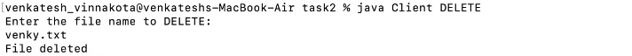
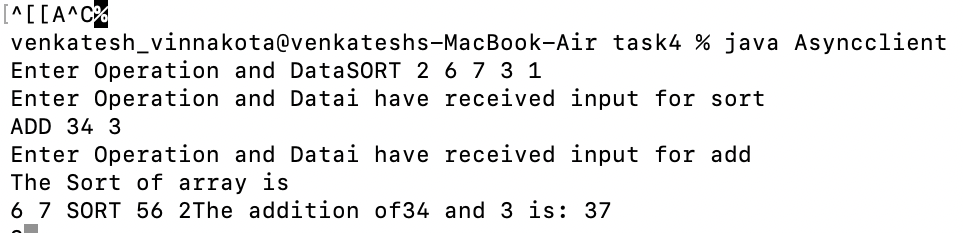

## Task2
### Instructions
- from the terminal, go task2 folder
- type javac* to compile the .java files of task 2
- type java Server to run
- type java Client operation (i.e,one of the four operations UPLOAD,DOWNLOAD,DELETE,RENAME ) to run.
  

## Task3
### Instructions
- from the terminal, go to task3 folder
- type javac* to compile the .java files of task 3
- type java Server1 to run
- type java WatchServiceTest to run
- any events like create,modify,delete in current directory will be fetched and will be reflected in the server and shown in    terminal.
.png)
.png)

## Task4
### Instructions
- from the terminal, go to task4 folder
- type javac* to compile the .java files of task 4
-  for synchronous run SyncServer and Part4Client
- Enter the operation
- 
-  for asynchronous run asynserver and asyncclient
- Enter the operation
- 
- for deferred synchronous run defferedSyncClient and DefferedSyncServer
- 
- Enter the operation
