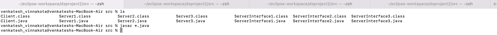
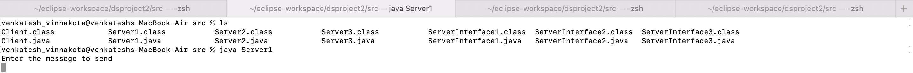
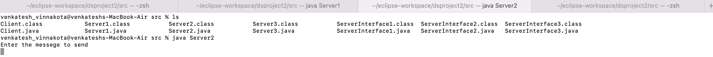
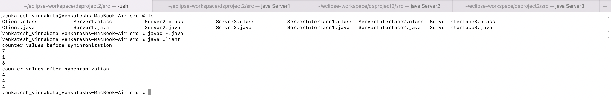
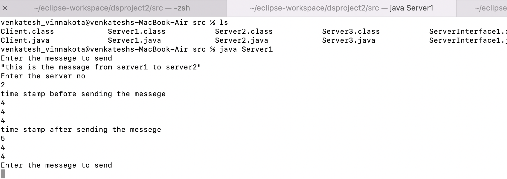
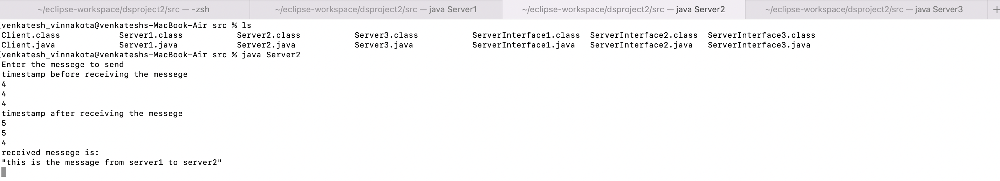

## Task2
### Instructions
- from the terminal, go to task2 directory.
- type javac* to compile the .java files of task 2.

- open another three tabs and run each of the server in each tab using java command(eg:java Server1).

- similarly, run the client program in the first tab.

- The client will run and print the counter values of the servers before and after synchronization.
- Go to any of the server tab and Enter the message and receiving server number. The time stamp of the logical clock is printed before and after sending the message by the sending server. The receving server will also print the messege received and timestamps.
- output on sending and receiving servers.

- Continue the same with different combinations and different directions.
  